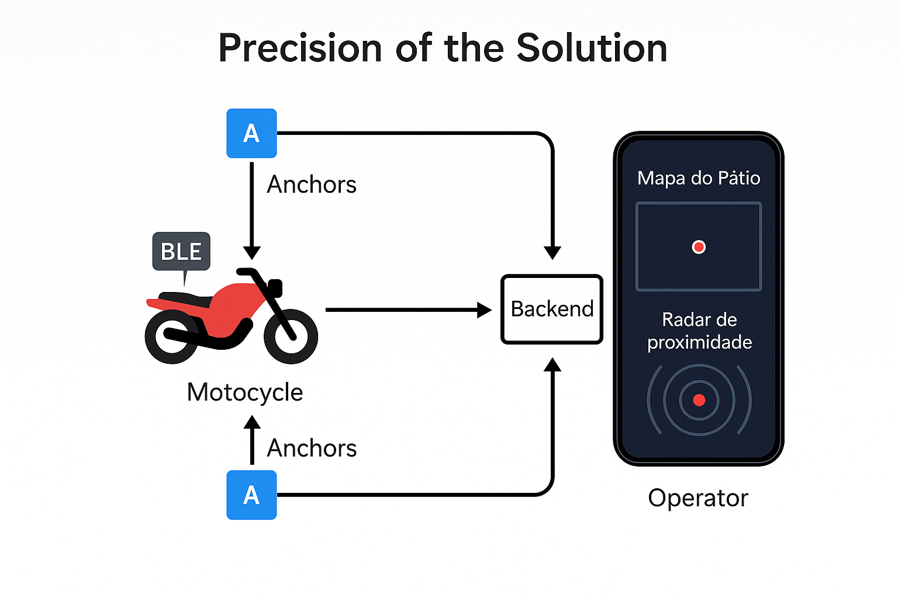
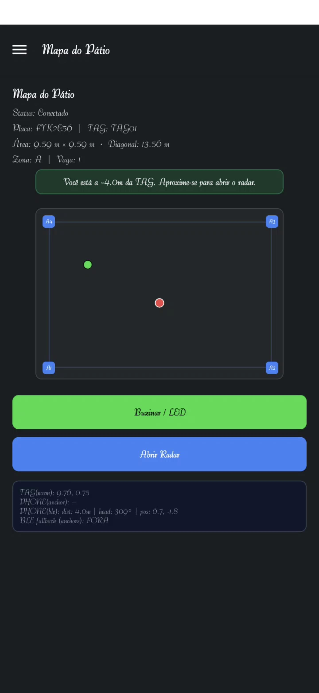
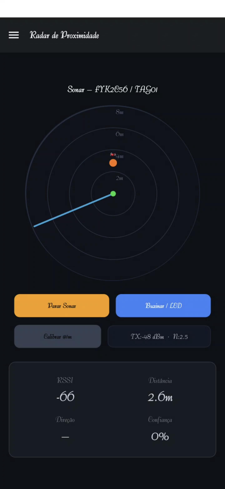

# 📱 Radar Motu - App de Gestão de Pátio (Entrega Mobile - 2º Semestre)

### *Sua frota sob controle, seu pátio na palma da mão.*

GitHub do Projeto: https://github.com/AntonioCarvalhoFIAP/challenge-3-ArthurBispo00?tab=readme-ov-file
---

## 👨‍💻👩‍💻👩‍💻 Equipe de Desenvolvimento

| Nome | RM | Turma |
| :--- | :--- | :--- |
| Paulo André Carminati | 557881 | 2-TDSPZ | 
| Arthur Bispo de Lima | 557568 | 2-TDSPV | 
| João Paulo Moreira | 557808 | 2-TDSPV |

---


*Diagrama da arquitetura conceitual da solução, incluindo a camada de backend e as interações do operador.*

---

## 🎯 Proposta do Aplicativo

Este projeto representa a evolução de um protótipo para um aplicativo funcional em React Native, focado em atender aos requisitos da disciplina de **Mobile Application Development**. A aplicação visa fornecer uma solução completa para a gestão de pátios de motocicletas, transformando a base de desenvolvimento anterior em um produto concreto, com código limpo, integração robusta com APIs e uma interface refinada.

O objetivo é demonstrar a aplicação prática de conceitos avançados de desenvolvimento mobile, incluindo gerenciamento de estado global, comunicação assíncrona com serviços de backend, arquitetura de código escalável e design de interface adaptativo.

---
## ✅ Atendimento aos Critérios de Avaliação

A seguir, detalhamos como o projeto atende a cada um dos critérios exigidos para a 3ª Sprint.

| Mapa do Pátio (Visão Geral) | Radar de Proximidade (Localização Fina) |
| :---: | :---: |
|  |  |

### 1. Telas Funcionais Integradas com API (40 pts)

O aplicativo se conecta a serviços de backend, utilizando Firebase para autenticação e uma **API de OCR própria** para reconhecimento de placas, além de estar preparado para a integração com uma API .NET para operações de dados.

> **a. Duas Funcionalidades Completas com API:** Foram implementadas duas funcionalidades centrais com integração robusta:
> 1.  **Autenticação de Usuários:** Cadastro, Login e Logout completos via **Firebase Authentication**, com persistência de sessão.
> 2.  **Reconhecimento de Placa (OCR):** Integração com um **servidor de OCR próprio** ([ArthurBispo00/servidor_OCR](https://github.com/ArthurBispo00/servidor_OCR)) que identifica placas automaticamente em imagens, utilizado nas telas de `Cadastro` e `OperacoesPorPlaca`.

> **b. Operações Completas (CRUD - em andamento):** As telas de `Cadastro` e `Listagem` foram evoluídas para o consumo de uma **API .NET**. Atualmente, a base para as operações de Criação (Create), Leitura (Read), Atualização (Update) e Exclusão (Delete) de veículos está pronta.

> **c. Tratamento Completo de Formulários:** Todos os formulários (Login, Cadastro de Usuário e Cadastro de Veículo) possuem tratamento robusto, incluindo:
> * Validação de campos (ex: formato de e-mail, senha com mínimo de 6 caracteres).
> * Mensagens de erro claras e informativas para o usuário.
> * Feedback visual e alertas de sucesso após a conclusão de uma operação.

> **d. Indicadores de Carregamento:** Todas as operações de rede que interagem com as APIs (login, cadastro, busca, etc.) exibem um `ActivityIndicator` (ícone de "loading"). Isso informa ao usuário que uma ação está em andamento, melhorando a experiência de uso.

### 2. Sistema de Login (20 pts)

O fluxo de autenticação foi implementado de forma completa e segura, utilizando **Firebase Authentication**, uma das opções recomendadas, garantindo persistência de sessão e proteção de dados.

> **a. Tela de Login:** Uma tela dedicada permite que usuários existentes acessem o aplicativo. A sessão é gerenciada pelo Firebase e persistida automaticamente, ou seja, o usuário permanece logado ao reabrir o app.

> **b. Tela de Cadastro:** Uma tela separada permite que novos usuários criem uma conta. Os dados são enviados ao Firebase para gerenciamento seguro das credenciais.

> **c. Logout Funcional:** Um botão de "Sair" (Logout) está presente na tela "Sobre Nós" e também no menu lateral (Drawer). Ao ser acionado, ele encerra a sessão do Firebase e redireciona o usuário para a tela de Login, limpando o histórico de navegação.

### 3. Estilização com Tema (15 pts)

O aplicativo possui um sistema de tema robusto, flexível e visualmente consistente, adaptando-se às preferências do usuário.

> **a. Modo Claro e Escuro:** O app utiliza o hook `useColorScheme` do React Native para detectar a preferência de tema do sistema operacional e inicia com o tema correto (claro ou escuro). Adicionalmente, um botão na tela "Sobre Nós" permite ao usuário alternar manualmente entre os modos a qualquer momento.

> **b. Personalização Consistente:** Através da Context API do React (`ThemeContext`), um objeto de tema centralizado distribui as paletas de cores e estilos para todas as telas, garantindo uma identidade visual coesa e uniforme com a marca "Radar Motu".

> **c. Adesão às Guidelines e Criatividade:** A interface emprega componentes e espaçamentos que seguem as boas práticas de design (Material Design para Android), apresentando botões, campos de texto e cartões bem definidos, ao mesmo tempo que mantém a identidade visual única e criativa do projeto.

### 4. Arquitetura de Código (15 pts)

O projeto foi estruturado com foco em clareza, manutenibilidade, separação de responsabilidades e utilizando as melhores práticas do desenvolvimento mobile.

> **Organização e Separação de Responsabilidades:** Todo o código-fonte está encapsulado no diretório `src/`. As responsabilidades são claramente divididas em subpastas: `screens` (telas completas), `components` (componentes reutilizáveis), `contexts` (gerenciamento de estado global como Tema e Autenticação), `navigation` (lógica de navegação e tipagens), `services` (camada de abstração de API) e `themes` (definições de estilos e cores).

> **Código Limpo e Boas Práticas:** A aplicação faz uso extensivo de Hooks do React, componentes funcionais e da Context API para um gerenciamento de estado limpo. A lógica de comunicação com a API é isolada na camada de `services`, e a navegação condicional (Login/App Principal) é orquestrada no `App.tsx`, demonstrando uma arquitetura bem planejada e elegante.

### 5. Documentação e Apresentação (10 pts)

> **README.md:** Este arquivo serve como a documentação técnica central do projeto, detalhando a proposta, as funcionalidades, a estrutura de pastas, as tecnologias utilizadas e os integrantes, atendendo a todos os requisitos.

---

## 4. Demonstração em Vídeo

Para uma visão completa da solução em funcionamento, desde o escaneamento da placa até a localização em tempo real com o radar, assista à nossa apresentação e demonstração no YouTube.

> ### 🎥 **[ASSISTIR AO VÍDEO DE DEMONSTRAÇÃO NO YOUTUBE]**
> *https://www.youtube.com/shorts/K9956kkluGk*

---

## 5. Tecnologias Utilizadas

Este projeto foi construído com uma combinação de tecnologias modernas e eficientes, focadas no desenvolvimento mobile em React Native e na integração com serviços de backend.

| Categoria | Tecnologias |
| :--- | :--- |
| **Frontend Mobile** |    |
| **Autenticação** |  |
| **Backend (Planejado)** |   |
| **Ferramentas** |    

## 6. Estrutura do Projeto

O código-fonte foi organizado em um formato de monorepo, separando de forma clara e lógica as três principais frentes do projeto: `radarmotu-api` (backend) e `radarmotu-app` (frontend). Essa abordagem facilita o desenvolvimento, a manutenção e a escalabilidade da solução.

## 6. Estrutura do Projeto

O código-fonte foi organizado em um formato de monorepo, separando de forma clara e lógica as três principais frentes do projeto:  `radarmotu-api` (backend) e `radarmotu-app` (frontend). Essa abordagem facilita o desenvolvimento, a manutenção e a escalabilidade da solução.

### 📁 `radarmotu-api` (Backend)

A API segue uma arquitetura robusta e modular, inspirada nas melhores práticas de desenvolvimento com FastAPI.

```t
radarmotu-api/
└── radarmotu-api/
    └── radarmotu-api/
        ├── routers/        # Define os endpoints da API (as "rotas")
        ├── services/       # Contém a lógica de negócio principal
        ├── .env.example    # Exemplo de variáveis de ambiente
        ├── anchors.json    # Configuração das posições das âncoras
        ├── database.py     # Gerencia a conexão com o banco de dados
        ├── estimator.py    # Módulo com o algoritmo de triangulação/localização
        ├── main.py         # Ponto de entrada principal da aplicação FastAPI
        ├── models.py       # Define as tabelas do banco de dados (SQLAlchemy)
        ├── schemas.py      # Define os schemas de dados para validação (Pydantic)
        ├── security.py     # Lógica de autenticação e segurança
        └── radarmotu.db    # Arquivo do banco de dados SQLite
```

main.py: Inicializa a aplicação e inclui os roteadores.

routers/: Cada arquivo aqui define um grupo de endpoints (ex: /vehicles, /tags), mantendo o código de roteamento organizado.

services/ e estimator.py: O coração da API. services orquestra as regras de negócio, enquanto estimator.py contém a lógica matemática para calcular a posição do veículo com base no RSSI.

models.py e schemas.py: Trabalham juntos para garantir que os dados que entram e saem da API e do banco de dados sejam sempre bem estruturados e validados.
---

## 📁 `radarmotu-app` (Frontend)

O aplicativo mobile foi arquitetado com uma estrutura de pastas clara e modular, seguindo as melhores práticas do desenvolvimento React Native para garantir a separação de responsabilidades, facilitar a manutenção e promover a escalabilidade do código.

```t
radarmotu-app/
├── assets/             # Ícones, logos e outras imagens estáticas do projeto.
├── src/                # Diretório principal do CÓDIGO-FONTE da aplicação.
│   ├── components/     # Componentes de UI genéricos e reutilizáveis (ex: botões, cards).
│   ├── config/         # Configurações de serviços (ex: Firebase e .env).
│   ├── contexts/       # Gerenciadores de estado global (Tema, Autenticação).
│   ├── navigation/     # Lógica de navegação e definição de tipos das rotas.
│   ├── screens/        # Componentes que representam as telas completas do app.
│   ├── services/       # Funções para comunicação com APIs externas.
│   └── themes/         # Definição dos temas (claro/escuro).
│
├── App.tsx             # Ponto de entrada. Responsável por carregar os provedores e a navegação.
└── package.json        # Lista de dependências e scripts do projeto.
```
Detalhamento das Responsabilidades

src/: É o coração da aplicação. Todo o código que escrevemos (telas, componentes, lógica, serviços) vive aqui dentro, completamente isolado das configurações de alto nível do projeto.

screens/: Contém as telas completas que o usuário vê. Cada arquivo é uma "página" do app.

components/: Guarda os "blocos de montar" reutilizáveis, garantindo consistência visual e evitando código repetido.

contexts/: Gerencia o estado global, como o tema atual (claro/escuro) e o status de login do usuário, disponibilizando essas informações para todo o app.

navigation/: Centraliza toda a lógica de navegação, incluindo a definição dos navegadores (Drawer, Stack) e os tipos de cada rota (types.ts).

services/: Camada responsável pela comunicação com o mundo exterior, como o Firebase ou a API .NET.

App.tsx: Agora é um arquivo extremamente limpo, com a única responsabilidade de inicializar os contextos globais e o sistema de navegação.

## 7. Como Rodar o Projeto do Zero

Siga os passos abaixo para configurar e executar o ambiente de desenvolvimento completo em sua máquina local.

### Pré-requisitos
* **Node.js (LTS)** e **npm**
* **Python 3.9+** e **pip**
* **Git**
* **Android Studio** com um Emulador Android configurado (ou um dispositivo físico)
* **Expo Go App** instalado no seu dispositivo físico (caso opte por não usar o emulador)

---
### Passo 1: Clonar o Repositório
```bash
git clone [URL_DO_SEU_REPOSITORIO]
cd [NOME_DA_PASTA_DO_PROJETO]

### Passo 2: Configurar e Rodar o Backend (API)

# Navegue até a pasta da API
cd radarmotu-api

# Crie e ative um ambiente virtual
python -m venv venv
# No Windows:
.\venv\Scripts\activate
# No Linux/Mac:
# source venv/bin/activate

# Instale as dependências do Python
pip install -r requirements.txt

# Entre na pasta da aplicação
cd radarmotu-api

# Inicie o servidor de desenvolvimento
uvicorn app.main:app --reload --host 0.0.0.0 --port 8000

✅ Pronto! A API estará rodando e acessível na sua rede local. Anote o seu endereço de IP (ex: 192.168.1.10), você precisará dele no App.

### Passo 3: Configurar e Rodar o Frontend (App)

# Em um novo terminal, navegue até a pasta do App
cd radarmotu-app

# Instale as dependências do Node.js
npm install

# (Opcional) Se encontrar erros de dependência, use:
npm install --legacy-peer-deps

# Inicie a aplicação Android
npx expo run:android

❗ Importante: Após iniciar a aplicação, abra o arquivo radarmotu-app/config/env.ts (ou similar) e atualize o endereço da API para o IP da máquina onde o backend está rodando (ex: http://192.168.1.10:8000).


Após configurar o IP, você pode:

Escanear o QR Code com o app Expo Go no seu celular.

